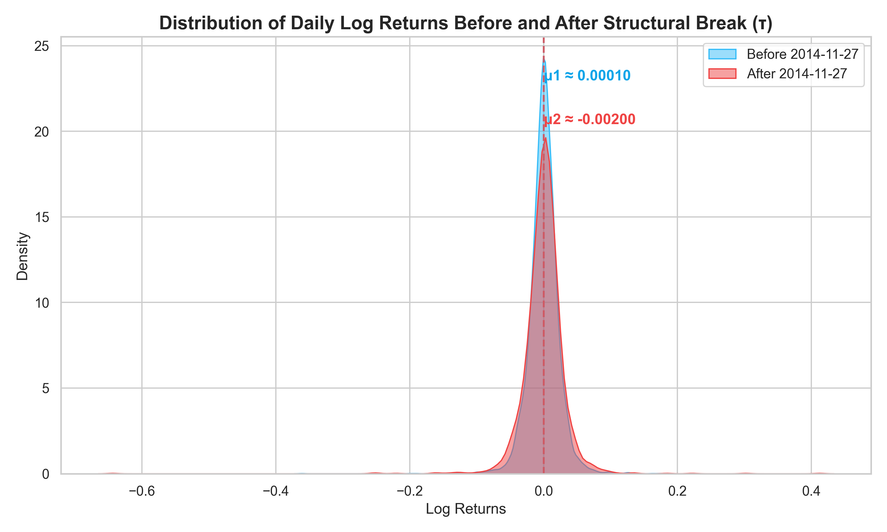

# Brent Oil Price Change Point Analysis

This project identifies and quantifies structural breaks in historical Brent crude oil prices using Bayesian Change-Point modeling (PyMC). It correlates detected shifts with significant geopolitical and macroeconomic events to provide actionable market context.

## 📂 Project Structure
- `data/`: Raw price data (`brent_daily.csv`) and curated event logs (`events.csv`).
- `notebooks/`: 
  - `01_EDA.ipynb`: Stationary tests, volatility analysis, and price transformations.
  - `02_change_point_pymc.ipynb`: Bayesian modeling, event ranking, and results export.
- `backend/`: Flask API and model results storage.
- `frontend/`: React dashboard (Vite + Recharts) with interactive shift-event mapping.
- `docs/`: Methodological framework and strategic documentation.
- `report/`: Professional summaries and interim findings.

## 📖 Methodology & Strategy
- [Data Analysis Workflow](./docs/WORKFLOW.md): Step-by-step modeling process.
- [Historical Events Summary](./docs/EVENTS_SUMMARY.md): Key price drivers and historical context.
- [Assumptions & Limitations](./docs/ASSUMPTIONS_LIMITATIONS.md): Model constraints and the correlation vs. causality caveat.
- [Stakeholder Communication Plan](./docs/COMMUNICATION_PLAN.md): How results are tailored for investors and policymakers.

---

## 🚀 Setup & Execution Guide

Follow these steps to set up the dual-stack application locally.

### 1. Prerequisite: Python Environment
First, ensure you have Python 3.8+ installed. It is recommended to use a virtual environment.

```bash
# Create a virtual environment
python -m venv venv

# Activate it
# On Windows:
.\venv\Scripts\activate
# On macOS/Linux:
source venv/bin/activate

# Install core dependencies
pip install -r requirements.txt
```

### 2. Backend Setup (Flask)
The backend serves the processed data and model results.

```bash
cd backend
# Optional: Install extra backend dependencies if not in requirements.txt
pip install flask flask-cors pandas numpy

# Start the API server
python app.py
```
*The API will be available at `http://localhost:5000`. Full endpoint documentation: [API_DOCUMENTATION.md](./backend/API_DOCUMENTATION.md).*

### 3. Frontend Setup (React + Vite)
The frontend provides the interactive visualization suite.

```bash
cd frontend
# Install Node modules
npm install

# Run the development server
npm run dev
```
*Access the dashboard at `http://localhost:5173`.*

---

## 🎮 Dashboard Interaction Guide

The dashboard is designed for deep-dive exploratory analysis. Key features include:

- **Structural Break Mapping**: The "Detected CP" card and the red vertical line in the chart indicate the Bayesian most-likely shift date.
- **Geopolitical Correlation**: Hover over any gold marker on the chart to see the event title. Select an event from the **Correlation Log** (bottom right) to highlight it on the chart and view a detailed **Impact Analysis** (shift in price and volatility).
- **Timeframe Navigation**: Use the date inputs in the header to zoom into specific historical periods (e.g., "2008-01-01" to "2010-12-31").
- **Metric Toggling**: Switch between **Price (USD)** and **Volatility** tabs in the main chart area to see different market behaviors around events.
- **Categorical Filters**: Filter the event log by type (Macro, Conflict, Policy, or Sanctions) using the dropdown in the header.

---

## 🛠️ Tech Stack & Methodology

| Component | Technology | Description |
| :--- | :--- | :--- |
| **Statistical Analysis** | Python (PyMC, ArviZ) | Bayesian Structural Break Detection (Change Point Analysis) |
| **Backend API** | Flask | Serves processed results, metrics, and correlation data |
| **Frontend UI** | React 19 + Vite | High-performance, reactive dashboard |
| **Visualizations** | Recharts | SVG-based responsive charting |
| **Styles** | Vanilla CSS | Custom Glassmorphism design system (Modern Dark Mode) |
| **Icons** | Lucide-React | Consistent, accessible iconography |

---

## 📸 Screenshots (Demonstration)
*(Note: Visual assets are generated during the analysis phase and can be found in `report/images/`)*

1.  **Main Overview**: Displays the Bayesian change point aligned with a 21% shift in mean returns.
2.  **Impact Panel**: Detailed metrics showing how "OPEC Production Adjustments" shifted volatility by +11%.
3.  **Filtered View**: Showing only "Regional Conflict" events across a 5-year window.
4.  **Distribution Shift**:
    
    *Comparative density plot showing the shift in the mean and variance of daily returns before and after the detected structural break.*
